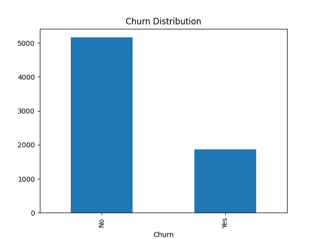
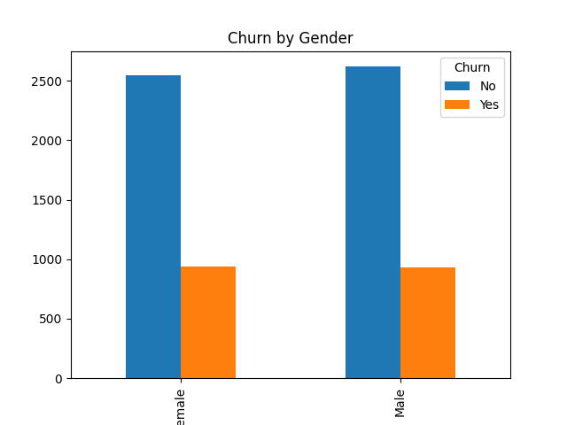
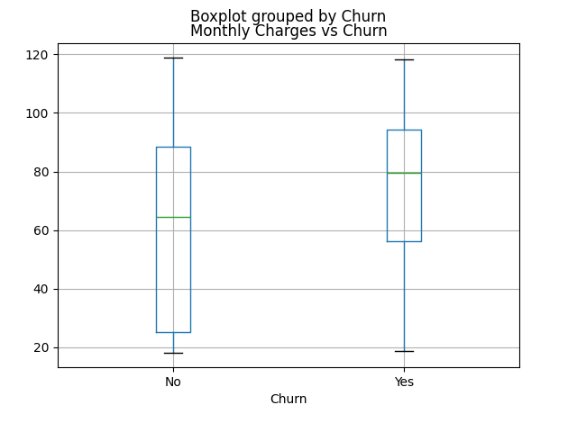

# Customer Churn Analysis (Task 2)

## 📌 Project Overview
This project focuses on analyzing customer churn data to understand why customers leave a service. By exploring patterns in customer behavior, we aim to identify key factors that influence churn and provide actionable business insights.

---

## 🛠 Tools & Technologies Used
- Python
- Pandas (Data manipulation)
- Matplotlib (Data visualization)

---

## 🎯 Objective
The main objective of this analysis is to:
- Identify trends and patterns in customer churn
- Understand the impact of customer demographics and services
- Discover factors contributing to customer retention and churn

---

## 📂 Dataset Description
The dataset contains customer information such as:
- Demographics (Gender, Senior Citizen, etc.)
- Account information (Tenure, Contract type)
- Services subscribed (Internet, Phone, etc.)
- Billing details (Monthly & Total Charges)
- Target variable: **Churn (Yes/No)**

---

## ⚙️ Steps Performed
1. Imported the dataset using pandas  
2. Explored data using `.head()`, `.info()`, `.describe()`  
3. Handled missing values and cleaned the dataset  
4. Converted data types (e.g., TotalCharges)  
5. Performed exploratory data analysis (EDA)  
6. Created visualizations to identify churn patterns  

---

## 📊 Data Visualization

### 🔹 Churn Distribution

### 🔹 Churn by Gender

### 🔹 Monthly Charges vs Churn

---

## 🔍 Key Insights
- Customers with **higher monthly charges** are more likely to churn  
- Customers with **month-to-month contracts** show higher churn rates  
- Gender has **minimal impact** on churn behavior  
- Long-term customers (higher tenure) are less likely to churn  
- Customers using multiple services tend to stay longer  

---

## 📈 Business Recommendations
- Offer **discounts or loyalty plans** for high monthly charge customers  
- Encourage customers to switch to **long-term contracts**  
- Improve customer experience for **new customers (low tenure)**  
- Provide **bundled service offers** to increase retention  

---

## ✅ Conclusion
Customer churn is influenced by multiple factors such as pricing, contract type, and service usage. By understanding these patterns, businesses can take proactive steps to improve customer retention and reduce churn rates.

---

## 🚀 Future Work
- Build a machine learning model to predict churn (Task 3)  
- Perform feature importance analysis  
- Deploy the model using a web application or dashboard  